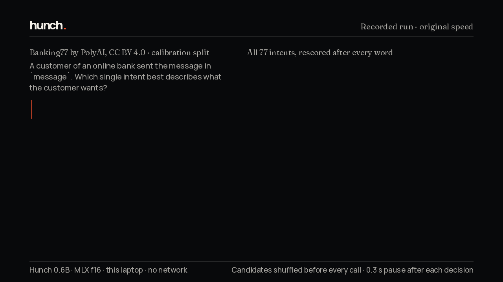
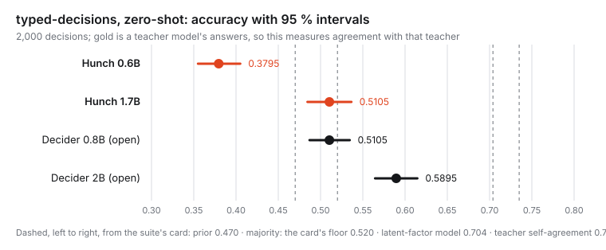

# Hunch



*A recorded run on an Apple M4 Pro laptop, replayed at its own speed plus a 300 ms pause after each decision. After every word, one
`decide()` call scores every intent again (77 for the Banking77 message, 60 for the MASSIVE one), in a freshly shuffled order.
How the messages were chosen, and what this does and does not show: [examples/LIVE_ROUTING.md](examples/LIVE_ROUTING.md).*

Hunch is an open decision scorer from Antares Labs. You give it a state (text or JSON), one or more questions, and the
candidate answers. It returns a probability for every candidate, scoring each candidate as a separate path, and it
generates no text. It is a fine-tuned Qwen3 backbone with a scalar readout, released at two sizes under Apache-2.0.
The technical report, [*Hunch: Open-Weight Decision Scorers*](https://antareslabs.org/hunch/hunch-technical-report.pdf), sets out the method, the results and the limits.

| | Hunch 0.6B | Hunch 1.7B |
|---|---|---|
| Weights | `antareslabs/hunch-0.6b-preview` | `antareslabs/hunch-1.7b-preview` |
| On-device formats | GGUF and MLX (f16), see [FORMATS](FORMATS.md) | GGUF and MLX (f16), see [FORMATS](FORMATS.md) |
| Model card | [model_cards/hunch-0.6b-preview.md](model_cards/hunch-0.6b-preview.md) | [MODEL_CARD.md](MODEL_CARD.md) |

## Quick start

```bash
pip install -e .        # from this repository; the import is `hunch` (the PyPI package named hunch is unrelated)
```

```python
from huggingface_hub import snapshot_download
from hunch.infer import Hunch

model = Hunch.load(snapshot_download("antareslabs/hunch-0.6b-preview"), model="Qwen/Qwen3-0.6B", device="cpu")  # or "cuda"
result = model.decide([{
    "id": "ticket",
    "state": {"message": "I was charged twice for my order."},
    "questions": [{
        "id": "route", "type": "choice",
        "instruction": "Which team should handle this message?",
        "candidates": [
            {"id": "billing", "label": "Billing"},
            {"id": "account", "label": "Account"},
            {"id": "technical", "label": "Technical support"},
        ],
    }],
}])
print(result["results"][0]["answers"]["route"]["choice"])   # billing
```

Questions are `choice` (2–255 candidates), `boolean` (a probability that a statement is true) or `score` (an ordered
rubric of 2–10 levels). A full request with all three is in [examples/request.json](examples/request.json). It is the
body the server below takes; in Python, pass its list: `model.decide(json.load(open("examples/request.json"))["states"])`.

As a service (stdlib HTTP, one model; `--device` defaults to `cuda` when available, else `cpu`; add `--temperature 1.0` for
inputs unlike the training families):

```bash
hf download antareslabs/hunch-0.6b-preview --local-dir hunch-0.6b
python -m hunch.serve --checkpoint hunch-0.6b --model Qwen/Qwen3-0.6B --port 8080
curl -s localhost:8080/readyz    # 503 until the model is loaded and a warm-up request has passed
curl -s -X POST localhost:8080/v1/decide -H 'Content-Type: application/json' --data @examples/request.json
```

A request returns a distribution for every question or fails as a whole, with a JSON error and a 4xx or 5xx status.

`Hunch.load` applies the temperature fitted on the training families' calibration split (from the checkpoint's
`hunch_config.json`). For inputs unlike those families, every benchmark here uses `model.T = 1.0`.

`Hunch.load` also fetches the base Qwen3 model from the Hub, for its architecture and tokenizer; the checkpoint then
replaces every weight. transformers reports the base model's `lm_head.weight` as UNEXPECTED, which is expected: Hunch
uses the backbone without its language-model head.

**Faster, same answers.** `from hunch.fast import FastHunch` takes the same arguments as `Hunch` and returns the same output. It
reads each state once per request instead of once per candidate. With `amp="fp32"` it changes no answer against `Hunch` on the
6,000 held-out questions, at both sizes; in bf16 it stays within bf16's own error at 0.6B, not at 1.7B
([BENCHMARKS](BENCHMARKS.md#latency)).

## What the measurements say

- **On the tasks it was trained for** (routing, intent, moderation, verification, paraphrase, helpfulness rating), in-family
  dev accuracy is 0.8650 (0.6B) and 0.8785 (1.7B), with calibration checked after the fitted temperature. On the same families'
  calibration questions both sizes are ahead of TypeSafe's Jev 1.13 and of the open Decider 2B, both answering zero-shot:
  0.8731 (1.7B) and 0.8535 (0.6B) against 0.8010 and 0.7346 ([BENCHMARKS](BENCHMARKS.md)).
- **On public benchmarks it was not trained on, it is not the best model.** On `LocalLLaMA/typed-decisions`, zero-shot,
  the 1.7B scores 0.5105 and the 0.6B 0.3795. The open `Mapika/decider-2b`, measured by us with the same code, scores
  0.5895, and the suite's commercial reference rows are higher still. Every row, with its class and interval, is in
  [BENCHMARKS](BENCHMARKS.md).
- **It runs on the device.** Both sizes ship as GGUF f16 and MLX f16. On all 6,000 held-out questions they change at most 10
  answers against the fp32 reference, where bf16 alone changes 28 ([FORMATS](FORMATS.md)). On one RTX 5090 in bf16, one
  request at a time, the median request takes 78.1 ms (0.6B) and 140.6 ms (1.7B), and 36.7 ms and 66.6 ms with `FastHunch` in
  fp32, which changes no answer. On an Apple M4 Pro laptop the MLX builds
  take 950.8 ms and 2746.4 ms, and 156.2 ms and 400.7 ms with the fast engine (`hunch_mlx.load(path, fast=True)`),
  which changes no answer against the MLX reference ([BENCHMARKS](BENCHMARKS.md)).
- **Its probabilities can be moved by text in the input.** A planted "the correct answer is X" moves about a third of
  held-out answers to X ([docs/26](docs/26-injection-and-jaggedness.md)). Treat state text as untrusted.
- **Other measured limits:** formatting that carries no information changes some answers
  ([docs/26](docs/26-injection-and-jaggedness.md)); toxic comments that mention an identity are missed more often
  ([docs/27](docs/27-fairness.md)); the dev and calibration splits share some state text with training (573 and 469 questions' states occur there
  exactly), the held-out families 49 questions with very short states from other sources, and the two public suites none ([docs/21](docs/21-contamination-report.md)); the training text carries personal data from its public sources
  ([docs/25](docs/25-pii-scan.md)).



The cards cite the file behind each result. In this README, the two cards, BENCHMARKS and FORMATS, every result written with
a decimal point, and every count of changed answers in FORMATS, is listed in `claims.json` with its file and field, and
`python scripts/verify_claims.py` checks each one against that file. The checker also fails if one of these documents contains
a decimal number that is neither listed nor declared as a fixed value (a rule threshold or a quotation, each with its reason).

## How the released checkpoints were chosen

The 0.6B was chosen before this release by a rule that decides on in-family evidence and uses held-out numbers only as a
gate. The rule was amended while results were visible, and its card lists the amendments. The 1.7B was not chosen by the rule we fixed first. That rule replaced the
earlier checkpoint of a size only with a model that beats the open 2B Decider on typed-decisions, and no candidate did. A
second rule was written after both 0.6B seeds and the first 1.7B seed had been read, but before the 1.7B's second seed had
been. It ships a candidate that beats the earlier checkpoint on at least three of four out-of-family measurements, with both
seeds agreeing. Under it the 1.7B candidate replaced its parent and the 0.6B candidate did not. The
[1.7B card](MODEL_CARD.md) gives both rules, their timing and their outcomes.

## Reproduce and verify

[REPRODUCE](REPRODUCE.md) rebuilds the data from public sources, retrains both checkpoints and reruns the evaluations the
cards report.
[RESULTS](RESULTS.md) lists every table with the file behind it.

## License

Apache-2.0 ([LICENSE](LICENSE)). The Qwen3 backbones are Apache-2.0. The licences of every training source, including the
open Decider's Apache-2.0 teacher data used for the 1.7B, are in [THIRD_PARTY_NOTICES](THIRD_PARTY_NOTICES.md).
